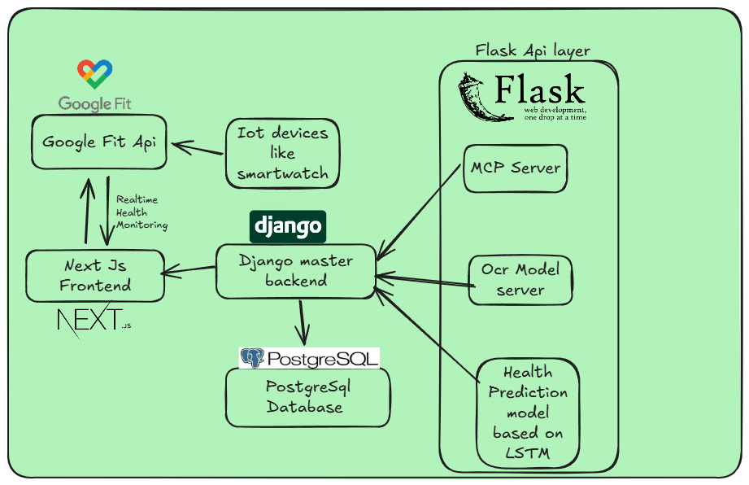

# Lazarus: Healthcare Operating System

**Team:** Lazarus  
**Team Leader:** Nitish Kumar Sah  
**Hackathon:** Jazzee Trillion Dollar Opportunity GEN-AI Hackathon (T$O2025)  
**Repository Name:** `Lazarus_NitishKumarSah_T$O2025`

---

## Overview

Lazarus is an AI-first healthcare operating system designed to digitize, unify, and intelligently manage patient medical records across India—spanning both rural and urban landscapes. It harnesses cutting-edge OCR, voice assistants, LLMs, and predictive analytics to streamline workflows, reduce errors, and enable preventive care through structured data and actionable insights. A key mission of Lazarus is to replace fragmented, paper-based healthcare systems with secure, intelligent, and patient-centric digital ecosystems.

---

## Video Pitch

Watch our in-depth pitch(Resubmission): 
📺 **Watch here:** [Link](https://youtu.be/zG8_Y0eGt-g)

Watch our 2-minute pitch that outlines the core problem, our Gen-AI-powered solution, and its potential real-world impact:

📺 **Watch here:** https://youtu.be/M_L52M-dmTI?si=hDHIX0M11_pDzJzH

---

## System Architecture and Workflow

### 🏗️ Architecture Diagram

Shows the integration of OCR, voice transcription, NLP pipelines, doctor verification systems, backend APIs, patient mobile/web apps, predictive AI models, and insurance claim modules—all connected to a secure Health Record Vault.

### 🔄 Workflow Overview

Illustrates the data journey: patient consultation, digitization of records, structured extraction, verification, reminders, analytics, and insurance integration.

---

## Core Functional Modules

---

### 🧾 Medical Prescription Digitization & Automation

**About the Product:**  
This module converts handwritten or printed prescriptions into structured digital records, verified by doctors and ready for downstream use such as reminders and insurance claims. It automates data entry, enhances compliance, and transforms prescriptions into actionable healthcare tools.

**Technical Workflow:**  
1. User uploads prescription image.  
2. Image enhancement (de-skewing, denoising).  
3. **Visual Transformer (e.g., LayoutLMv3/LLaVA)** segments the document into header, body, footer.  
4. A **fine-tuned LLM (e.g., Ollama)** semantically parses the content.  
5. Doctor details are verified using **SurePass API**.  
6. Medicines and instructions are converted into structured JSON.  
7. Smart medication reminders are scheduled based on timing instructions.  
8. Verified data is stored for future use and insurance submission.

**Why This is Better:**  
It goes beyond basic OCR by integrating layout-aware vision models and LLM-based contextual understanding. This enables accurate parsing of complex handwritten content and adds functionality like doctor verification and automated reminder scheduling.

**Why Our Approach is Better:**  
Most tools end at unstructured text extraction. We deliver structured, verified, actionable health records, integrating directly into patient reminders and insurance claims—making it a truly intelligent prescription management solution.

### 🩺 Doctor Voice Assistant: Verified Voice-to-Prescription System

**About the Product:**  
This tool enables doctors to dictate prescriptions, which are instantly transcribed and structured into verified digital records. It supports multilingual input and ensures each prescription is authenticated via SMS/email-based verification within 10 hours.

**Technical Workflow:**  
1. Voice captured via app/web interface.  
2. Transcription via **Whisper** or **Google Speech-to-Text**.  
3. Segmentation into doctor, patient, diagnosis, and medication sections using NLP.  
4. Doctor signs digitally; a secure verification link is sent via **Twilio/SMTP**.  
5. Time-bound (10-hour) verification ensures traceability and integrity.  
6. Summarized prescription generated and stored securely.

**Why This is Better:**  
Unlike typical voice-to-text systems, this module incorporates a structured pipeline with multilingual support, simplified summaries, and mandatory verification—striking a balance between efficiency and safety.

**Why Our Approach Stands Out:**  
It introduces an enforceable, secure approval mechanism for doctors that most existing solutions lack. This makes it practical for telehealth, small clinics, and multilingual environments where errors can have high stakes.

### 💊 Intelligent Medication Reminder and Notification System

**About the Product:**  
A multi-channel reminder system that allows patients to receive alerts based on prescription schedules or custom input. Alerts are synced with Google Calendar and delivered via SMS or WhatsApp, supporting real-world adherence to medication.

**Technical Workflow:**  
1. Prescription uploaded and parsed using the OCR+LLM pipeline.  
2. Medicines, dosages, and schedules extracted.  
3. Reminders created and pushed to Google Calendar.  
4. Notifications sent via SMS/WhatsApp using APIs.  
5. Users can manually add, snooze, or mark reminders as taken.  
6. All medication activity is logged for future reference.

**Why This is Better:**  
Combines automation with flexibility, ensuring timely medication via platforms users already use. No need for manual entry or mobile-only usage.

**Why Our Approach Wins:**  
Other systems either offer rigid, manual entry workflows or limited alert options. Ours provides structured extraction from real prescriptions and integrates reminders across channels, tailored for both individual patients and caregivers.

---

### 🧠 Smart Healthcare Assistant with Integrated Insurance Claim Support

**About the Product:**  
A centralized assistant that helps patients track diagnoses, treatments, and submit documentation for insurance claims without manual paperwork. It bridges clinical care and financial access through intelligent automation.

**Technical Workflow:**  
1. Structured data extracted from records using Visual Transformer + LLM.  
2. Records stored and categorized.  
3. At diagnosis, user selects documents to send to insurers via verified APIs.  
4. Insurance policies fetched and linked to the user profile.  
5. Reminders generated automatically from prescription data.

**Why This is Better:**  
It unifies clinical records and insurance processes—offering a seamless experience from treatment to claim submission. Saves time during emergencies and ensures better health-finance coordination.

**Why Our Approach is Unique:**  
Unlike isolated apps, Lazarus integrates insurance workflows into patient health tracking—automating the most error-prone parts of the claim process.

---

## Framework Document

The comprehensive 2-page framework is available in the repository:

📄 **Download:** `Lazarus_Nitish Kumar Sah_Jazzee2025_Document.pdf`

Includes:
- Problem Definition  
- User Context  
- Gen-AI Relevance  
- System Workflow  
- Tech Stack  
- Feasibility & Scalability  
- MLP (Minimum Lovable Product)

---

## Feasibility and Tech Stack

- **Frontend:** React / Flutter (responsive, multilingual support)  
- **Backend:** FastAPI / Django REST Framework + PostgreSQL  
- **AI/NLP Models:** Hugging Face LLMs, Tesseract, Whisper, LayoutLMv3, Ollama  
- **Cloud Infra:** AWS / GCP with encryption and logging  
- **Integrations:** SurePass API, Twilio, SMTP, Google Calendar, Insurance APIs

---

## Scalability & Impact

- Enables doctor efficiency and reduces burnout.  
- Empowers rural healthcare workers with offline voice tools.  
- Supports better adherence and reduces readmission.  
- Facilitates real-time insurance processing.  
- WHO-estimated 30% treatment cost reduction through prevention and compliance.

---

## Minimum Lovable Product (MLP)

The Lazarus MLP includes:
- **Verified Voice-to-Prescription Tool**  
- **AI-Powered Prescription Digitization Tool**  
- **Smart Reminder System**  
- **Integrated Insurance Submission Module**

This ready-to-deploy suite can be piloted in small clinics or rural health centers—creating a path toward scalable, intelligent digital healthcare across India.
